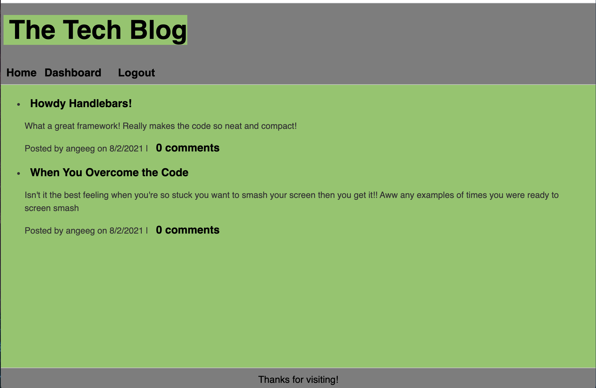

# tech-blog

## Description 
This tech-blog was created for new developers, like myself, or even code veterans, to share their knowledge, ideas, and thoughts on any type of coding material. Whether its a coding language, framework, library, what have you. This is the place to spill your thoughts and interact with fellow coders. The coding world can feel pretty alone when your cooped up at home stuck on the screen for hours, but thanks to the lovely internet and the exponential coding community, starting a conversation with another coder is only a click away. 

## Installation 
This application was meant to be used on the deployed heroku app, which <a href="https://angeeg-tech-blog.herokuapp.com/">view here</a>. However, if you wish to install the app locally to your machine clone <a href="https://github.com/angeeg/tech-blog.git">this repo code</a> and open the it in your code editor. You will need to run "npm i" to initialize all of it's dependencies, then run "npm start" in the terminal of the root directory where you cloned the repo. 

## Usage 
Use this app the interact with other coders, share your thoughts, struggles, ideas,anything you'd like that'd code related. 

<a href="https://angeeg-tech-blog.herokuapp.com/">Tech Blog Website</a>

## Credit 
This application was created by <a href="https://github.com/angeeg">angeeg</a>.

## Technologies Used 
* Handlebars 
* Javascript 
* CSS
* Express 
* Sequelize 

## Questions/Contribution
If you have any questions or would like to contribute to this app, please contact myself (<a href="https://github.com/angeeg">angeeg</a>) via github.